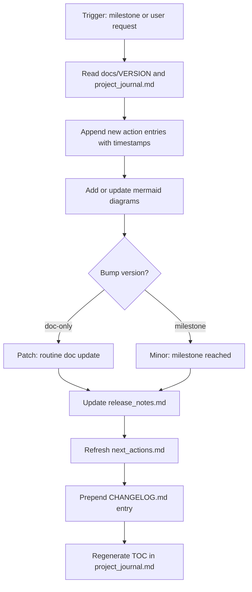

# Project Journal

Keep a living, human-readable record of what the user and agent did — in order, with timestamps, a table of contents, and mermaid diagrams.

## Files this skill owns

| File | Role |
|------|------|
| `docs/project_journal.md` | Master log — TOC, sequential actions, mermaid per major phase |
| `docs/release_notes.md` | Short user-facing notes for the current version |
| `docs/next_actions.md` | 3–7 next steps for the user |
| `docs/VERSION` | Single-line semver (e.g. `0.2.1`) |
| `CHANGELOG.md` | Root summary ([Keep a Changelog](https://keepachangelog.com/) format) |

## When to run

- User asks to document, journal, update release notes, or record actions
- After a milestone (scaffold, feature, GitHub push, Vercel deploy)
- Before starting a new phase
- End of a meaningful work session

## Update workflow

1. Read `docs/VERSION` and `docs/project_journal.md`
2. Append new action entry (never delete or rewrite past entries)
3. Add or update mermaid diagrams where they aid readability
4. Bump version in `docs/VERSION` (see rules below)
5. Update `docs/release_notes.md` for the current version
6. Refresh `docs/next_actions.md`
7. Prepend entry to `CHANGELOG.md`
8. Regenerate the TOC at the top of `project_journal.md`



## Version bump rules

- **Patch** (`0.1.0` → `0.1.1`): new action entries, copy edits, routine journal updates
- **Minor** (`0.1.x` → `0.2.0`): GitHub push, Vercel first deploy, feature complete
- **Major**: breaking restructure or public v1 launch — ask user first

## Action entry format

Append-only. Use sequential IDs (`A001`, `A002`, …).

```markdown
### A{NNN} — {YYYY-MM-DD HH:MM +TZ} — {Short title}

| Field | Value |
|-------|-------|
| Actor | User / Agent / Both |
| Version | 0.x.y |
| Category | planning \| scaffold \| feature \| git \| deploy \| docs |

**Summary:** One sentence.

**Details:**
- What happened, commands run, files created, URLs

**Artifacts:** `path/to/file`, https://...

---
```

**Timestamps:** Use wall-clock with timezone (e.g. `+0530`). Default to UTC if unknown. Stay consistent within a project.

## TOC rule

Regenerate after every update at the top of `project_journal.md`:

```markdown
## Table of contents
- [Overview](#overview)
- [Timeline](#timeline)
- [Documentation map](#documentation-map)
- [Actions](#actions)
  - [A001 — Title](#a001--2026-05-23-1500-0530--title)
```

GitHub-style anchors: lowercase, spaces → `-`, strip punctuation.

## Mermaid rule

Include at least:

1. **Overview diagram** — high-level project arc
2. **Per-phase diagram** when a phase has 3+ steps
3. **Documentation map** — how journal, VERSION, release notes, next actions, and CHANGELOG relate

## Do not

- Put secrets, tokens, or `.env` values in docs
- Remove or rewrite past action entries
- Create docs outside `docs/` except root `CHANGELOG.md`

## Templates

Copy-paste templates: [templates.md](templates.md)
