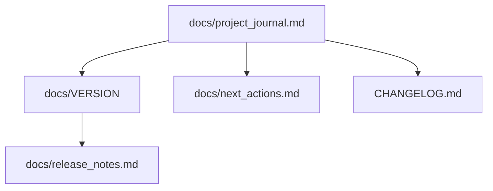

# Project Journal — Templates

## Action entry

```markdown
### A{NNN} — {YYYY-MM-DD HH:MM +TZ} — {Short title}

| Field | Value |
|-------|-------|
| Actor | User / Agent / Both |
| Version | 0.x.y |
| Category | planning \| scaffold \| feature \| git \| deploy \| docs |

**Summary:** One sentence.

**Details:**
- Bullet details

**Artifacts:** `path/to/file`

---
```

## project_journal.md — header block

```markdown
# Project journal

> **Doc version:** {VERSION} · **Last updated:** {timestamp}

## Table of contents
- [Overview](#overview)
- [Timeline](#timeline)
- [Documentation map](#documentation-map)
- [Actions](#actions)

## Overview

{1–2 paragraph summary}


## Timeline

| Phase | Status | Version |
|-------|--------|---------|
| Planning | Done | 0.1.0 |

## Documentation map



## Actions
```

## release_notes.md

```markdown
# Release notes — v{VERSION}

## Highlights
- Bullet 1
- Bullet 2

## What changed
- A00X — description

## Links
- Repo: https://github.com/...
- Live: https://... (when available)
```

## next_actions.md

```markdown
# Next actions

> Last updated: {timestamp} · Doc version {VERSION}

1. **{Action}** — one line why
2. **{Action}** — one line why
```

## CHANGELOG.md entry

```markdown
## [{VERSION}] - {YYYY-MM-DD}

### Added
- Item

### Changed
- Item

### Deployed
- Item
```

## VERSION file

```
0.2.1
```

Single line, no prefix. Semver only.
