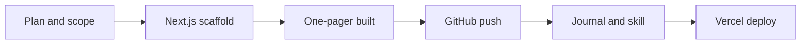
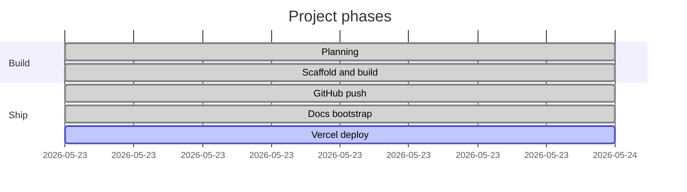
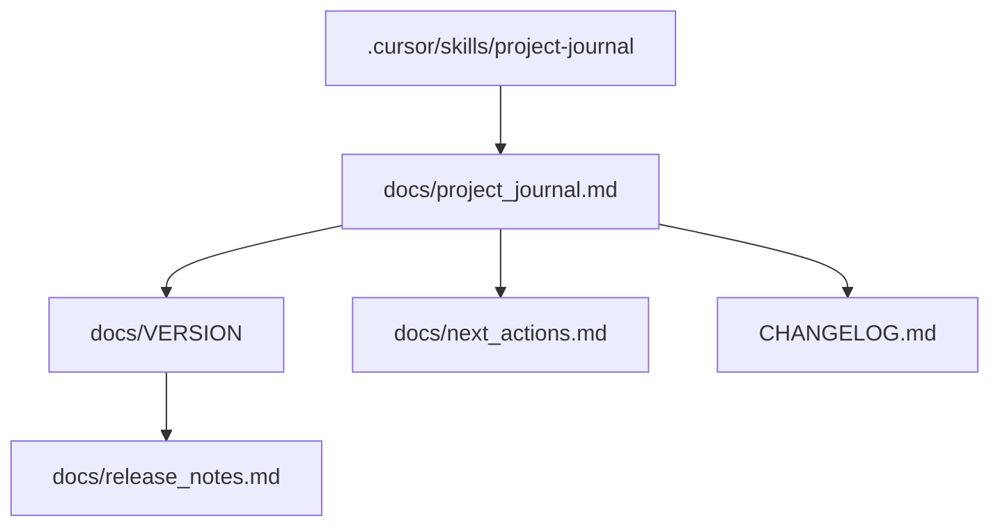
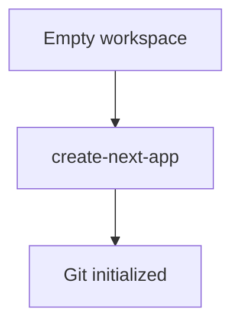
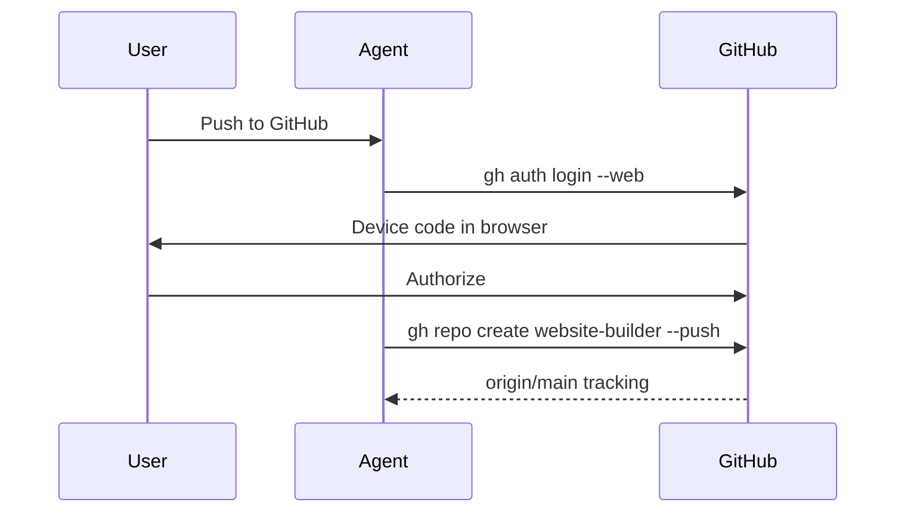

# Project journal

> **Doc version:** 0.2.1 · **Last updated:** 2026-05-23 16:15 +0530

## Table of contents

- [Overview](#overview)
- [Timeline](#timeline)
- [Documentation map](#documentation-map)
- [Actions](#actions)
  - [A001 — Planned AI teaching one-pager](#a001--2026-05-23-1430-0530--planned-ai-teaching-one-pager)
  - [A002 — Saved plan to Plan.md](#a002--2026-05-23-1445-0530--saved-plan-to-planmd)
  - [A003 — Scaffolded Next.js + Tailwind](#a003--2026-05-23-1540-0530--scaffolded-nextjs--tailwind)
  - [A004 — Built teaching one-pager](#a004--2026-05-23-1555-0530--built-teaching-one-pager)
  - [A005 — Verified production build](#a005--2026-05-23-1600-0530--verified-production-build)
  - [A006 — GitHub web auth, repo create, and push](#a006--2026-05-23-1602-0530--github-web-auth-repo-create-and-push)
  - [A007 — Project journal skill and docs bootstrap](#a007--2026-05-23-1615-0530--project-journal-skill-and-docs-bootstrap)

---

## Overview

This project is a **one-page teaching website** that walks beginners through building software with **Cursor → GitHub → Vercel**. The site itself demonstrates the workflow it describes.

**Stack:** Next.js 16 (App Router), TypeScript, Tailwind CSS  
**Repo:** https://github.com/goyal-s/website-builder  
**Status:** Built and pushed to GitHub; Vercel deploy pending

---

## Timeline

| Phase | Status | Version | Date |
|-------|--------|---------|------|
| Planning | Done | 0.1.0 | 2026-05-23 |
| Scaffold | Done | 0.1.1 | 2026-05-23 |
| Feature build | Done | 0.1.2 | 2026-05-23 |
| GitHub push | Done | 0.2.0 | 2026-05-23 |
| Documentation | Done | 0.2.1 | 2026-05-23 |
| Vercel deploy | Pending | — | — |

---

## Documentation map

| File | Purpose |
|------|---------|
| `docs/project_journal.md` | Full sequential action log (this file) |
| `docs/VERSION` | Current doc semver |
| `docs/release_notes.md` | Short release summary |
| `docs/next_actions.md` | What to do next |
| `CHANGELOG.md` | Root changelog summary |
| `.cursor/skills/project-journal/` | Team skill for maintaining docs |

---

## Actions

### A001 — 2026-05-23 14:30 +0530 — Planned AI teaching one-pager

| Field | Value |
|-------|-------|
| Actor | Both |
| Version | 0.1.0 |
| Category | planning |

**Summary:** Agreed on scope, stack, and page structure for a Cursor/GitHub/Vercel teaching site.

**Details:**
- Chose meta workflow content: teach the exact stack used to build the site
- Chose Next.js + TypeScript + Tailwind on Vercel
- Defined sections: Hero, Overview, Cursor, GitHub, Vercel, Walkthrough, Footer
- Created initial plan via Cursor Plan mode

**Artifacts:** Cursor plan file, later saved as `Plan.md`

---

### A002 — 2026-05-23 14:45 +0530 — Saved plan to Plan.md

| Field | Value |
|-------|-------|
| Actor | User |
| Version | 0.1.0 |
| Category | planning |

**Summary:** User saved the agreed plan to the project root for reference.

**Details:**
- Plan stored at `Plan.md` in workspace root
- Includes todos: scaffold, build, polish, GitHub, Vercel

**Artifacts:** `Plan.md`

---

### A003 — 2026-05-23 15:40 +0530 — Scaffolded Next.js + Tailwind

| Field | Value |
|-------|-------|
| Actor | Agent |
| Version | 0.1.1 |
| Category | scaffold |

**Summary:** Initialized Next.js App Router project with TypeScript, Tailwind, and ESLint.

**Details:**
- Ran `npx create-next-app@latest` (moved `Plan.md` aside during scaffold, restored after)
- Git repo initialized by create-next-app
- Commit: `78fbcbf` — Initial commit from Create Next App

**Artifacts:** `package.json`, `app/layout.tsx`, `app/page.tsx`, `app/globals.css`

---

### A004 — 2026-05-23 15:55 +0530 — Built teaching one-pager

| Field | Value |
|-------|-------|
| Actor | Agent |
| Version | 0.1.2 |
| Category | feature |

**Summary:** Implemented the full single-scroll teaching page with all planned sections.

**Details:**
- Sticky nav with anchor links to all sections
- Hero, Overview (Code → Save → Ship), Cursor, GitHub, Vercel, Walkthrough, Footer
- Inline components: `CodeBlock`, `ToolBadge`, `StepList`, `ToolSection`
- Updated metadata, `globals.css` (light theme, smooth scroll), `app/icon.svg`
- Updated `README.md` with local dev and deploy instructions

**Artifacts:** `app/page.tsx`, `app/layout.tsx`, `app/globals.css`, `app/icon.svg`, `README.md`

---

### A005 — 2026-05-23 16:00 +0530 — Verified production build

| Field | Value |
|-------|-------|
| Actor | Agent |
| Version | 0.1.2 |
| Category | feature |

**Summary:** Confirmed the site compiles and static routes generate successfully.

**Details:**
- `npm run build` passed (Next.js 16.2.6, Turbopack)
- Static routes: `/`, `/icon.svg`
- Local dev available via `npm run dev` at http://localhost:3000

**Artifacts:** `.next/` build output

---

### A006 — 2026-05-23 16:02 +0530 — GitHub web auth, repo create, and push

| Field | Value |
|-------|-------|
| Actor | Both |
| Version | 0.2.0 |
| Category | git |

**Summary:** Authenticated via GitHub CLI web flow, created public repo, and pushed `main`.

**Details:**
- Installed GitHub CLI (`gh`) via winget
- Web device auth completed as **goyal-s**
- Committed one-pager: `6057310` — Add AI teaching one-pager…
- Created repo `website-builder` and pushed to `origin/main`
- Renamed branch from `master` to `main`

**Artifacts:** https://github.com/goyal-s/website-builder

---

### A007 — 2026-05-23 16:15 +0530 — Project journal skill and docs bootstrap

| Field | Value |
|-------|-------|
| Actor | Both |
| Version | 0.2.1 |
| Category | docs |

**Summary:** Created Team skill for ongoing documentation and bootstrapped all doc files with backfilled actions.

**Details:**
- Authored `.cursor/skills/project-journal/SKILL.md` and `templates.md`
- Created `docs/project_journal.md`, `docs/release_notes.md`, `docs/next_actions.md`, `docs/VERSION`
- Created root `CHANGELOG.md`
- Saved plan as `PLAN_Project Journal Team Skill + Documentation Bootstrap.md`
- Semver set to **0.2.1** (patch after GitHub milestone docs)

**Artifacts:** `docs/`, `CHANGELOG.md`, `.cursor/skills/project-journal/`, `PLAN_Project Journal Team Skill + Documentation Bootstrap.md`

---
